# Vimeo: where the next dollar comes from

**For:** the business owner of Vimeo Self-Serve and Enterprise
**Sources:** Vimeo, Inc. annual reports (10-K, covering 2021–2024) and quarterly reports (10-Q, Q1–Q3 2025) filed with the SEC; every figure traced in [data/SOURCES.md](../data/SOURCES.md)
**Status:** an outside-in exercise on public data. Assumptions are mine and labelled; the test results are simulated.
**Context:** Bending Spoons agreed to buy Vimeo on 10 September 2025 for $7.85 a share, about $1.38 billion in cash, and completed the deal on 24 November 2025; Vimeo then left Nasdaq, so the Q3 2025 10-Q is its last quarterly report. This memo reads the business as it stood at the handover and uses nothing published after it.

**Try it:** [the interactive model](https://d0m3n1c0x.github.io/vimeo-growth-case/model/) recomputes the case and the test as you move each assumption.

> The question: Self-Serve has lost subscribers every quarter for three years while price held revenue up. Where does growth come from next, and how would we know before spending on it?

## The answer

- **Self-Serve is running on price.** Subscribers fell 21% from 2021 to 2024 and ARPU rose 9%. In 2025 subscribers are down 11% a year in every quarter, and ARPU growth has accelerated to +13%. Price cannot outrun an 11% annual loss for long.
- **Enterprise carried the growth, and it is slowing.** Enterprise revenue went from $23.2M to $83.2M between 2021 and 2024, but in Q3 2025 its bookings fell 2% on the year before.
- **The biggest lever is between the two.** An Enterprise account pays about 120 times a Self-Serve one ($24,567 against $204 a year), and Vimeo's own filings say Enterprise is often an upgrade from Self-Serve.
- **The bet:** score the Self-Serve base for team-level signals and route the 2% with the strongest ones (22,558 accounts) to sales. At 1 extra upgrade per 100 accounts a year its three-year net present value is $2.2M, with payback in year 2.
- **The test decides it, not the model.** The bet pays only above 0.68% upgrades per account a year. A 90-day test cannot see that; a 180-day one-sided test on the eligible base can, with 20,982 of 22,558 accounts.

## 1. What the filings say

| 2021 → 2024, US$ millions | Volume (subscribers) | Price (ARPU) | Rounding | Change |
|---|---:|---:|---:|---:|
| Self-Serve & Add-Ons | −$28.7M | +$24.1M | +$1.0M | −$3.6M |
| Vimeo Enterprise | +$51.6M | +$8.9M | −$0.6M | +$60.0M |
| Other | −$86.6M | +$55.5M | +$0.1M | −$31.1M |

*Volume is the change in average subscribers at the mid ARPU; price is the change in ARPU at the mid subscriber count. Rounding is what the published ARPU, rounded to the dollar, leaves unexplained.*

In 2025 Vimeo regrouped its categories, so the quarterly series stands apart from the annual one. On the new basis, the price effect on Self-Serve is growing each quarter:

| Self-Serve, year on year | Subscribers | ARPU | Bookings | Volume effect | Price effect |
|---|---:|---:|---:|---:|---:|
| Q1 2025 | −11% | +8% | +6% | −$6.8M | +$4.0M |
| Q2 2025 | −11% | +11% | +11% | −$6.9M | +$6.1M |
| Q3 2025 | −11% | +13% | +14% | −$6.9M | +$7.2M |

**Two observations to test, not conclusions.** Advertising fell from $87.1M in 2021 to $32.4M in 2024, and Self-Serve average subscribers moved from +6% to −10% a year over the same years: three data points, consistent with acquisition spend driving the base, not proof of it. Meanwhile the company turned an operating margin of −16% into +4%, with sales and marketing down from 39% to 29% of revenue.

## 2. Three places to look, sized

| Bet | Size | Why now | Order |
|---|---|---|---|
| More price on Self-Serve | Each 1% of ARPU ≈ $2.3M a year on a $235M run rate | Already in motion; the open question is how much of the 11% loss price causes | Second: a price holdout cohort |
| Route Self-Serve teams to Enterprise | $6.0M net new revenue in year 3 at plan | Uses the existing base, no new acquisition spend; adds a pipeline as Enterprise bookings slow | **First** |
| Stop the Add-Ons decline | $30.5M → $24.8M in the first nine months, −19% | Vimeo attributes it to lower bandwidth demand; packaging bandwidth into plans may matter more than selling it | Third |

## 3. The business case

The model starts from Q3 2025: 1,127,900 Self-Serve subscribers at $204 a year and Enterprise ARPU of $24,567. Upgrades start at 50% of the Enterprise average ($12,284), keep 90% of revenue each year after the first, and stop paying their Self-Serve plan, counted as lost every year even for accounts that later leave Enterprise (the conservative choice). The sales team is hired for the plan before the real uplift is known, so its cost is fixed.

| US$ | Year 1 | Year 2 | Year 3 |
|---|---:|---:|---:|
| Net new revenue | $1,362,447 | $3,810,249 | $6,008,670 |
| Gross profit | $1,062,709 | $2,971,994 | $4,686,762 |
| Account executives | $1,080,000 | $1,080,000 | $1,080,000 |
| Outreach | $676,740 | $676,740 | $676,740 |
| Build | $400,000 | $0 | $0 |
| **Contribution** | −$1,094,031 | $1,215,254 | $2,930,022 |

**Net present value $2.2M at 10%, payback in year 2.** Because the team is a fixed cost, value is linear in the uplift, and it is zero at **0.68% upgrades per eligible account a year**: the bar the test must clear.

| Driver | Low | High | NPV at low | NPV at high |
|---|---:|---:|---:|---:|
| uplift | 0.004 | 0.02 | −$2.0M | $9.2M |
| entry acv share | 0.3 | 0.7 | −$0.6M | $5.0M |
| eligible share | 0.01 | 0.04 | $0.9M | $4.8M |
| upgrades per ae | 20.0 | 60.0 | −$0.5M | $3.1M |
| outreach cost | 15.0 | 60.0 | $3.1M | $0.5M |
| retention | 0.75 | 1.05 | $1.3M | $3.2M |
| gross margin | 0.7 | 0.82 | $1.5M | $2.6M |

*Sorted by swing. The uplift dominates: it is the one number no filing can provide, which is why the next section exists.*

## 4. How to test it before hiring for it

Randomise eligible accounts 50/50: treatment gets outreach, control gets the product as today. Primary metric: upgrades to Enterprise in the window. Guardrail: Self-Serve cancellations must not rise by more than half a point per 90 days.

| Design | Needed | Available | Feasible |
|---|---:|---:|---|
| 90 days, two-sided | 53,540 | 22,558 | No |
| 90 days, one-sided | 42,174 | 22,558 | No |
| 180 days, one-sided | 20,982 | 22,558 | Yes |
| 90 days, one-sided, eligibility doubled | 154,130 | 45,116 | No |

*Sample sizes to detect the break-even uplift at 80% power, α = 5%. Organic upgrades are assumed at 0.4% in 90 days, a number to read from Vimeo's own data first.*

**The decision rule, in order:** a broken 50/50 split invalidates the test; without a significant uplift there is nothing to protect; then the cancellations guardrail; then the business bar. Scale only if the uplift is significant and at least break-even.

Run 200 times on simulated accounts, the rule scales a bet with no real effect in 0% of tests and a bet at plan in 78%. The cost: the guardrail stops about 6% of good bets by chance, which a larger margin or a longer window would reduce.

One simulated run, read with the [workbook's readout sheet](../deliverables/vimeo_upgrade_case.xlsx): control 0.81%, treatment 1.17%, uplift 0.73% a year (one-sided p = 0.003). Decision: *Scale: the uplift is real and above break-even*.

## 5. Is the test worth running?

A test costs money and half a year, so it is not free insurance. Put a belief on the real uplift, then compare three options: launch now, do nothing, or test first and follow the rule. Value is linear in the uplift, so each option's expected value is a weighted sum over the scenarios; the chance that the test says *Scale* at each uplift comes from 300 simulated tests.

| True uplift a year | Sceptical prior | Optimistic prior | NPV if launched now | Test says Scale |
|---|---:|---:|---:|---:|
| 0.0% | 25% | 10% | −$4.73M | 0% |
| 0.4% | 20% | 10% | −$1.95M | 14% |
| 0.7% | 20% | 20% | $0.13M | 56% |
| 1.0% | 20% | 30% | $2.21M | 82% |
| 1.5% | 15% | 30% | $5.68M | 94% |

| Expected value | Sceptical prior | Optimistic prior |
|---|---:|---:|
| Launch now | −$0.25M | $1.73M |
| Do nothing | $0.00M | $0.00M |
| Test first, then follow the rule | $0.57M | $1.61M |
| **Value of running the test** | **+$0.57M** | **−$0.12M** |
| Best option | Test first | Launch now |

**The answer depends on the belief, and that is the point.** If the average expectation sits below break-even (sceptical prior, mean 0.65%), launching blind loses $0.25M in expectation and the test is worth $0.57M. If it sits well above (optimistic, mean 0.93%), the test costs more than it saves and launching is better by $0.12M. The test also has a price in errors: at 0.4% a year, below break-even, it still says *Scale* in 14% of runs.

## 6. What I would want to know first

- **The organic upgrade rate** from Self-Serve to Enterprise, by plan and team size: it sets the sample size.
- **Which signals predict an upgrade** in past data (seats, sign-on attempts, bandwidth, company domains): they define who is eligible.
- **Why Self-Serve customers cancel**, by price change and by tenure: it decides whether more price is safe.
- **Sales capacity**: whether the Enterprise team can absorb about 225 more deals a year, or needs hiring.

## Method and limits

- **Two engines, one answer.** Every figure is computed in pandas and again by live formulas in [the workbook](../deliverables/vimeo_upgrade_case.xlsx); its Reconciliation sheet checks each pair, and CI recalculates it with LibreOffice.
- **Public data only.** Subscriber metrics are transcribed from the filings and checked: categories add up to the reported revenue, and ARPU × average subscribers reproduces each category's revenue within 2%.
- **Two bases.** Vimeo regrouped its categories in 2025; the annual and quarterly series are never joined.
- **Assumptions are mine.** Eligibility, uplift, contract size, retention and costs are judgements, shown in the sensitivity table; the test results are simulated. Not investment advice.

